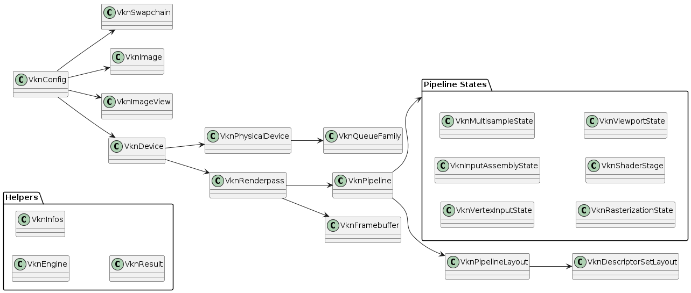

# VknConfig: A Modern Vulkan Configuration Library
# Readme generated by Gemini, but I'll get around to editing it later.

[](https://opensource.org/licenses/MIT)

## Overview

VknConfig is a C++ library designed to simplify the configuration and management of Vulkan applications. It provides a structured and object-oriented approach to handling common Vulkan tasks, such as:

*   Instance creation and management
*   Physical and logical device selection
*   Swapchain creation and management
*   Render pass and pipeline configuration
*   Resource management (buffers, images, etc.)
*   Error handling

VknConfig aims to reduce boilerplate code and improve the readability and maintainability of Vulkan projects.

## Features

*   **Object-Oriented Design:** Encapsulates Vulkan objects and their configurations within well-defined C++ classes.
*   **Structured Hierarchy:** Organizes Vulkan resources and their relationships in a clear hierarchy.
*   **Simplified Configuration:** Provides high-level methods for common Vulkan setup tasks.
*   **Error Handling:** Integrates error handling through the `VknResult` class.
*   **Extensible:** Designed to be easily extended with new features and functionality.
* **Modern C++:** Uses modern C++ features.

## Project Structure

The VknConfig project is organized into a clear hierarchy of classes, with some utility classes that can be used anywhere. The diagram below illustrates the relationships between the core classes:



**Key Components:**

*   **`VknConfig` (Top-Level):** The main entry point for configuring the Vulkan instance, devices, and surfaces.
*   **`VknDevice` (Hierarchy-Bound):** Manages a Vulkan logical device and its associated resources.
*   **`VknPhysicalDevice` (Hierarchy-Bound):** Manages a Vulkan physical device and its properties.
*   **`VknSwapchain` (Hierarchy-Bound):** Manages a Vulkan swapchain and its associated image views.
*   **`VknImageView` (Hierarchy-Bound Leaf):** Wraps a Vulkan `VkImageView` object.
*   **`VknRenderpass` (Hierarchy-Bound):** Manages a Vulkan render pass and its associated pipelines.
*   **`VknPipeline` (Hierarchy-Bound):** Manages a Vulkan graphics pipeline.
*   **`VknVertexInputState` (Hierarchy-Bound Leaf):** Configures the vertex input state for a graphics pipeline.
*   **`VknInputAssemblyState` (Hierarchy-Bound Leaf):** Configures the input assembly state for a graphics pipeline.
*   **`VknMultisampleState` (Hierarchy-Bound Leaf):** Configures the multisample state for a graphics pipeline.
*   **`VknRasterizationState` (Hierarchy-Bound Leaf):** Configures the rasterization state for a graphics pipeline.
*   **`VknShaderStage` (Hierarchy-Bound Leaf):** Configures a shader stage for a graphics pipeline.
*   **`VknViewportState` (Hierarchy-Bound Leaf):** Configures the viewport and scissor state for a graphics pipeline.
*   **`VknQueueFamily` (Hierarchy-Bound Leaf):** Represents a Vulkan queue family and its properties.
*   **`VknEngine` (Free/Top-Level):** Manages core Vulkan objects and resources.
*   **`VknInfos` (Free/Top-Level):** Provides methods for filling Vulkan info structures.
*   **`VknResult` (Free/Top-Level):** Represents a Vulkan API result and provides error handling.

## Getting Started

### Prerequisites

*   A C++20 compatible compiler (e.g., GCC, Clang, MSVC)
*   CMake (version 3.29 or higher)
*   Vulkan SDK
*   GLFW3
* VMA

### Building

1.  Clone the repository:

    ```bash
    git clone https://github.com/your-username/VknConfig.git
    cd VknConfig
    ```

2.  Create a build directory:

    ```bash
    mkdir VknConfig_build
    cd VknConfig_build
    ```

3.  Configure the project with CMake:

    ```bash
    cmake .. -DCMAKE_TOOLCHAIN_FILE=path/to/vcpkg/scripts/buildsystems/vcpkg.cmake
    ```
    (Replace `path/to/vcpkg` with the actual path to your vcpkg installation.)

4.  Build the project:

    ```bash
    cmake --build . --config Release
    ```

### Usage

(Provide a simple code example here to demonstrate how to use the library. This could be a basic Vulkan setup.)

```cpp
#include "VknConfig/include/VknConfig.hpp"
#include "VknConfig/include/VknEngine.hpp"

int main() {
    vkn::VknEngine engine{};
    vkn::VknInfos infos{};
    vkn::VknConfig config{&engine, &infos, nullptr};
    // ... your Vulkan code here ...
    return 0;
}
